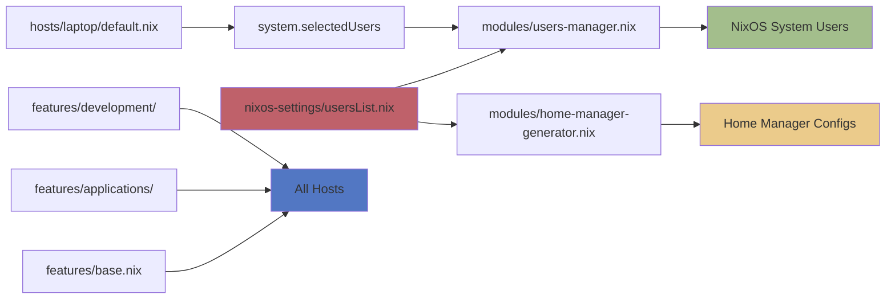
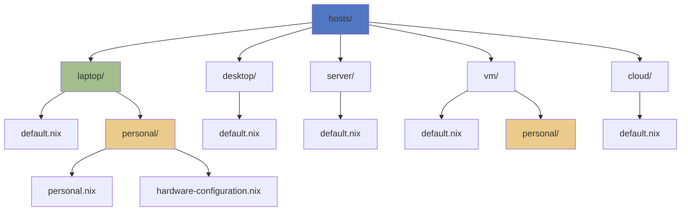
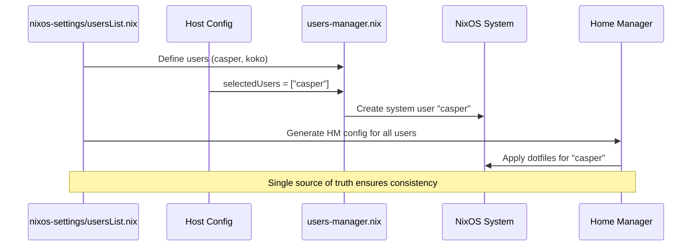

# MyNixOS

> **Professional, Multi-Host NixOS Configuration with Flakes & Home Manager**

A modern, declarative, and reproducible NixOS configuration system designed for flexibility, scalability, and ease of use. Manage multiple machines (laptops, desktops, servers, VMs, cloud instances) from a single, well-organized repository.

---

## 📑 Table of Contents

- [Features](#-features)
- [Quick Start](#-quick-start)
  - [Prerequisites](#prerequisites)
  - [Installation](#installation)
  - [First Build](#first-build)
- [Project Structure](#-project-structure)
- [Usage](#-usage)
  - [Building Configurations](#building-configurations)
  - [Managing Users](#managing-users)
  - [Adding Packages](#adding-packages)
- [Customization](#-customization)
  - [Creating New Hosts](#creating-new-hosts)
  - [Adding Features](#adding-features)
  - [Adding Users](#adding-users)
- [Documentation](#-documentation)
- [Architecture](#-architecture)
- [Contributing](#-contributing)
- [License](#-license)

---

## ✨ Features

### 🎯 Core Capabilities
- **Multi-Host Support**: Manage laptops, desktops, servers, VMs, and cloud instances from one repo
- **Automatic Discovery**: Hosts are auto-discovered - just create a folder and it's available
- **Variant System**: Create host variants (e.g., `laptop@personal`, `laptop@work`) with zero configuration
- **Centralized User Management**: Define all users once in `nixos-settings/usersList.nix`
- **Dynamic Configuration**: No manual lists - everything is discovered automatically

### 🖥️ Desktop Environment
- **KDE Plasma 6** with Wayland support
- **SDDM** display manager
- **Dark/Light** theme variants
- **Custom wallpapers** (internet or local)
- **Complete font stack** (Fira Code, Noto fonts)

### 📦 Applications
- **Browsers**: Firefox (default), Brave
- **Terminals**: Alacritty, Kitty, GNOME Terminal, Konsole
- **File Managers**: Dolphin, Thunar, Ranger, Nautilus
- **Text Editors**: Vim, Emacs, Neovim, Kate, Gedit
- **Media Tools**: VLC, GIMP, Krita, Audacity, FFmpeg
- **Office Suite**: LibreOffice, OnlyOffice, Calibre
- **System Tools**: btop, htop, neofetch, wireshark, and more

### 💻 Development
- **Languages**: Python (extensible to others)
- **Containers**: Docker, Kubernetes (k3s)
- **Databases**: MySQL, MSSQL, Redis
- **IDEs**: VSCode
- **Version Control**: Git, GitHub CLI

### 🔧 System Features
- **Audio**: PipeWire with WirePlumber
- **Bluetooth**: Full support
- **Printing**: CUPS + SANE scanning
- **Power Management**: Laptop optimizations
- **Hibernation**: Suspend-to-disk support
- **Networking**: NetworkManager
- **Firewall**: Configurable per-host rules

---

## 🚀 Quick Start

### Prerequisites

- **NixOS** installed on your machine
- **Git** for cloning the repository
- Basic understanding of Nix and flakes
- **Enable flakes** in your NixOS configuration:
  ```nix
  # /etc/nixos/configuration.nix
  nix.settings.experimental-features = [ "nix-command" "flakes" ];
  ```

### Installation

1. **Clone the repository:**
   ```bash
   git clone https://github.com/DandelionBold/MyNixOS.git
   cd MyNixOS
   ```

2. **Review available configurations:**
   ```bash
   nix flake show
   ```

3. **Customize for your needs:**
   - Edit `nixos-settings/usersList.nix` to add/modify users
   - Choose which features to enable in `hosts/<hostname>/default.nix`
   - Set your timezone/locale in `features/system/locale.nix`

### First Build

1. **Test build (doesn't apply changes):**
   ```bash
   nixos-rebuild build --flake .#laptop
   ```

2. **Apply configuration:**
   ```bash
   sudo nixos-rebuild switch --flake .#laptop
   ```

3. **Build Home Manager configuration (optional):**
   ```bash
   home-manager switch --flake .#casper
   ```

**Available Hosts:**
- `laptop` - Laptop configuration with power management
- `laptop@personal` - Personal laptop variant
- `desktop` - Desktop configuration
- `server` - Headless server
- `vm` - Virtual machine
- `vm@personal` - Personal VM variant
- `cloud` - Cloud instance

---

## 📁 Project Structure

```
MyNixOS/
├── flake.nix                      # Main flake configuration (auto-discovers hosts)
├── flake.lock                     # Lock file for reproducible builds
├── LICENSE                        # MIT License
├── README.md                      # This file
├── ROADMAP.md                     # Project roadmap and milestones
│
├── nixos-settings/                # Centralized configuration management
│   ├── usersList.nix             # Single source of truth for ALL users
│   └── README.md                 # User system documentation
│
├── hosts/                         # Host configurations (auto-discovered!)
│   ├── laptop/
│   │   ├── default.nix           # Base laptop configuration
│   │   └── personal/
│   │       ├── personal.nix      # Personal variant
│   │       └── hardware-configuration.nix
│   ├── desktop/default.nix
│   ├── server/default.nix
│   ├── vm/default.nix
│   └── cloud/default.nix
│
├── features/                      # Reusable feature modules
│   ├── base.nix                  # Base features (ALL hosts import this)
│   ├── gaming.nix                # Gaming support (Steam, Proton)
│   ├── applications/              # Application configurations
│   │   ├── browsers.nix
│   │   ├── terminals.nix
│   │   ├── file-managers.nix
│   │   ├── gui-text-editors.nix
│   │   ├── cli-text-editors.nix
│   │   ├── screenshot-tools.nix
│   │   ├── media-tools.nix
│   │   ├── office-suite.nix
│   │   ├── system-tools.nix
│   │   └── other-applications.nix
│   ├── desktop-environments/      # Desktop environment configs
│   │   ├── desktop-environment.nix
│   │   └── kde-plasma.nix
│   ├── development/               # Development tools
│   │   ├── dev.nix
│   │   ├── containers.nix        # Docker, k3s
│   │   ├── databases.nix         # MySQL, MSSQL, Redis
│   │   ├── programming-languages.nix
│   │   ├── ides.nix              # VSCode, etc.
│   │   └── version-control.nix   # Git
│   ├── hardware/                  # Hardware-related features
│   │   ├── audio.nix             # PipeWire
│   │   ├── bluetooth.nix
│   │   └── printing.nix          # CUPS + SANE
│   └── system/                    # System-level features
│       ├── locale.nix            # Timezone, language, keyboard
│       ├── networking.nix        # NetworkManager
│       ├── filesystems-btrfs.nix
│       ├── hibernate.nix
│       ├── power.nix
│       └── themes/               # Theme configurations
│           ├── themes.nix
│           ├── dark-theme.nix
│           ├── light-theme.nix
│           └── backgrounds/
│
├── modules/                       # Low-level system modules
│   ├── users-manager.nix         # Dynamic user creation
│   ├── home-manager-generator.nix # Automatic HM config generation
│   ├── vm.nix                    # VM-specific settings
│   ├── nginx.nix                 # Web server
│   └── firewall-allowlist.nix    # Firewall rules
│
├── docs/                          # Documentation
│   └── README.md                 # Complete beginner's guide
│
├── overlays/                      # Nixpkgs overlays (placeholder)
│   └── README.md
│
└── secrets/                       # Secrets management (placeholder)
    └── README.md
```

---

## 💻 Usage

### Building Configurations

#### Build and Apply System Configuration

```bash
# Test build without applying (safe)
nixos-rebuild build --flake .#laptop

# Apply configuration (requires sudo)
sudo nixos-rebuild switch --flake .#laptop

# Build with variant
sudo nixos-rebuild switch --flake .#laptop@personal

# Update flake inputs and rebuild
nix flake update
sudo nixos-rebuild switch --flake .#laptop
```

#### Build Home Manager Configuration

```bash
# Apply Home Manager for a user
home-manager switch --flake .#casper

# Build without applying
home-manager build --flake .#casper
```

### Common Commands

```bash
# Show all available configurations
nix flake show

# Check flake for errors
nix flake check

# Update specific input
nix flake lock --update-input nixpkgs

# List system generations
nix-env --list-generations --profile /nix/var/nix/profiles/system

# Rollback to previous generation
sudo nixos-rebuild switch --rollback

# Garbage collection (free space)
sudo nix-collect-garbage -d

# Optimize nix store
sudo nix-store --optimise
```

### Managing Users

#### Select Users for a Host

```nix
# hosts/laptop/default.nix
{
  system.selectedUsers = [ "casper" "alice" ];
}
```

#### Define New User

```nix
# nixos-settings/usersList.nix
rec {
  username = "alice";
  isNormalUser = true;
  extraGroups = [ "wheel" "networkmanager" ];
  shell = pkgs.bashInteractive;
  homeDirectory = "/home/${username}";
  
  # Home Manager config
  bash = { ... };
  git = { ... };
}
```

### Adding Packages

#### System-Wide Packages

```nix
# features/applications/other-applications.nix
environment.systemPackages = with pkgs; [
  my-new-package
];
```

#### User-Specific Packages (Home Manager)

```nix
# nixos-settings/usersList.nix (in user definition)
bash = {
  packages = with pkgs; [ my-user-package ];
};
```

---

## 🎨 Customization

### Creating New Hosts

#### 1. Create Host Directory and Configuration

```bash
# Create new host folder
mkdir -p hosts/workstation

# Create configuration file
touch hosts/workstation/default.nix
```

#### 2. Configure the Host

```nix
# hosts/workstation/default.nix
{ config, pkgs, lib, ... }:

{
  imports = [
    ../features/base.nix
    ../features/desktop-environments/kde-plasma.nix
    ../features/applications/browsers.nix
    # Add more features as needed
  ];

  networking.hostName = "workstation";
  networking.firewall.enable = false;
  
  # NixOS state version
  system.stateVersion = "25.05";
  
  # Select users for this host
  system.selectedUsers = [ "casper" ];
}
```

#### 3. Build It

```bash
# No need to modify flake.nix - auto-discovered!
sudo nixos-rebuild switch --flake .#workstation
```

### Creating Host Variants

#### 1. Create Variant Directory

```bash
# Create variant folder
mkdir -p hosts/laptop/work
```

#### 2. Create Variant Configuration

```nix
# hosts/laptop/work/work.nix
{ config, pkgs, lib, ... }:

{
  # Import base laptop configuration
  imports = [ ../default.nix ];
  
  # Override or add work-specific settings
  services.nginx.enable = true;
  
  # Different users for work laptop
  system.selectedUsers = [ "alice" ];
}
```

#### 3. Build It

```bash
# Auto-discovered! No flake.nix changes needed
sudo nixos-rebuild switch --flake .#laptop@work
```

### Adding Features

#### 1. Create Feature File

```bash
# Create in appropriate category
touch features/applications/my-app.nix
```

#### 2. Configure the Feature

```nix
# features/applications/my-app.nix
{ config, lib, pkgs, ... }:

{
  # Install packages
  environment.systemPackages = with pkgs; [
    my-application
  ];
  
  # Configure the application (if needed)
  programs.my-application = {
    enable = true;
    # settings...
  };
}
```

#### 3. Import in Host

```nix
# hosts/laptop/default.nix
{
  imports = [
    ../features/applications/my-app.nix  # Add this line
  ];
}
```

### Adding Users

#### 1. Edit Users List

```nix
# nixos-settings/usersList.nix
{
  usersList = [
    # ... existing users
    
    # Add new user
    rec {
      # === NixOS System User Configuration ===
      username = "bob";
      isNormalUser = true;
      description = "Bob - Developer";
      extraGroups = [ "wheel" "networkmanager" "docker" ];
      shell = pkgs.bashInteractive;
      homeDirectory = "/home/${username}";
      
      # === Home Manager Configuration ===
      bash = {
        enable = true;
        shellAliases = {
          ll = "ls -la";
          gs = "git status";
        };
      };
      
      git = {
        enable = true;
        userName = "Bob";
        userEmail = "bob@example.com";
      };
    };
  ];
}
```

#### 2. Select User in Host

```nix
# hosts/desktop/default.nix
{
  system.selectedUsers = [ "casper" "bob" ];  # Add bob
}
```

#### 3. Build

```bash
# Build system (creates user)
sudo nixos-rebuild switch --flake .#desktop

# Build Home Manager for bob
home-manager switch --flake .#bob
```

---

## 🏗️ Architecture

### System Overview

```mermaid
graph TB
    A[flake.nix] --> B[Auto-Discovery]
    B --> C[Scan hosts/ directory]
    B --> D[Import nixos-settings/]
    
    C --> E[Generate nixosConfigurations]
    D --> F[Generate homeConfigurations]
    
    E --> G[laptop]
    E --> H[laptop&#64;personal]
    E --> I[desktop]
    E --> J[server]
    
    F --> K[casper]
    F --> L[koko]
    
    style A fill:#5277c3
    style B fill:#7ebae4
    style E fill:#a3be8c
    style F fill:#ebcb8b
```



### Configuration Flow



### Host Hierarchy



### User Management Flow



### Feature Organization

```
features/
├── base.nix (imported by ALL hosts)
│   ├── locale.nix
│   ├── networking.nix
│   └── users-manager.nix
│
├── applications/ (user apps)
├── desktop-environments/ (UI)
├── development/ (dev tools)
├── hardware/ (audio, bluetooth, printing)
└── system/ (locale, power, themes)
```

---

## 📚 Documentation

Comprehensive documentation is available in the `docs/` directory:

- **[Complete Guide](docs/README.md)** - Comprehensive documentation covering:
  - Quick start for experienced users
  - Complete beginner's guide (assumes zero knowledge)
  - Troubleshooting common issues
  - Advanced customization techniques
  
- **[Features Documentation](features/README.md)** - Detailed feature organization and usage

- **[User Management](nixos-settings/README.md)** - Centralized user system documentation

- **[ROADMAP](ROADMAP.md)** - Project roadmap and implementation status

### Key Concepts

| Concept | Description |
|---------|-------------|
| **Hosts** | Individual machine configurations (laptop, desktop, server, etc.) |
| **Variants** | Host-specific customizations (e.g., `laptop@personal`, `laptop@work`) |
| **Features** | Reusable configuration modules organized by category |
| **Modules** | Low-level system components used by features |
| **Users** | Centrally defined in `usersList.nix`, selected per host |

---

## 🤝 Contributing

Contributions are welcome! Here's how you can help:

### Reporting Issues

1. **Check existing issues** to avoid duplicates
2. **Provide details**:
   - What you tried to do
   - What happened (error messages, logs)
   - What you expected to happen
   - Your NixOS version and system info

### Submitting Changes

1. **Fork the repository**
2. **Create a feature branch**:
   ```bash
   git checkout -b feature/my-improvement
   ```
3. **Make your changes**:
   - Follow the existing code style
   - Add comments explaining complex logic
   - Test your changes thoroughly
4. **Commit with clear messages**:
   ```bash
   git commit -m "feat: add support for XYZ"
   ```
5. **Push and create PR**:
   ```bash
   git push origin feature/my-improvement
   ```

### Guidelines

- **Features**: Place in appropriate `features/` subfolder
- **Documentation**: Update relevant docs when changing behavior
- **Comments**: Explain WHY, not just WHAT
- **Testing**: Test on a VM before submitting
- **Compatibility**: Ensure changes work across host types

---

## 📄 License

This project is licensed under the **MIT License** - see the [LICENSE](LICENSE) file for details.

---

## 🙏 Acknowledgments

- [NixOS](https://nixos.org/) - The purely functional Linux distribution
- [Home Manager](https://github.com/nix-community/home-manager) - Declarative user environment management
- [nixy themes](https://github.com/anotherhadi/nixy/tree/main/themes) - Theme system inspiration
- The NixOS community for excellent documentation and support

---

## ⭐ Star History

If you find this project useful, please consider giving it a star! ⭐

---

**Built with ❤️ using NixOS**